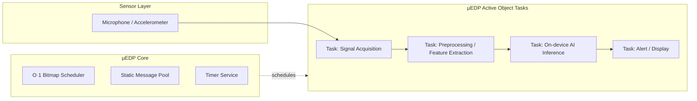

# CE201 — Predictive Maintenance via Acoustic Fingerprint on μEDP


**CE201** is a capstone/graduation project that builds an edge node running on real hardware, using
**[μEDP](https://github.com/1811htsang/uEDP)** as the scheduling runtime and integrating a **TinyML**
model to detect anomalies in a machine's vibration/acoustic signal — a **Predictive Maintenance via
Acoustic Fingerprint** application.

This is the next step for μEDP, following the direction recommended by the thesis advisor
(ThS. Nguyễn Duy Xuân Bách, 14/08/2026): μEDP becomes the "engine" that schedules everything, while
the AI pipeline and the demo product are the visible, runnable deliverable required for a graduation
thesis.

---

## 🎯 Relationship to μEDP

| | μEDP | CE201 |
| --- | --- | --- |
| Role | Core runtime (Active Object / event-driven kernel) | Edge application running on top of μEDP + AI pipeline |
| Status | General-purpose, multi-platform framework (STM32/ESP32/Linux) | Concrete demo product: predictive maintenance |
| Contribution of this project | — | Embed TinyML inference as an Active Object task, benchmark it, and build the data → train → deploy pipeline |

μEDP provides an O(1) priority scheduler, deterministic static message pools, and an ISR-safe
delayed-mapping mechanism — properties required to run AI inference interleaved with real-time tasks
without breaking the embedded system's determinism. CE201 builds directly on this core without
modifying it (zero-touch porting).

---

## 🧩 System Idea

```text
Sensor (vibration / acoustic) → Signal preprocessing → On-device AI inference
        → State classification (normal / anomaly) → Alert / display
```

Each block in the pipeline above is implemented as an **Active Object task**, scheduled by μEDP's
core — leveraging run-to-completion semantics and static message pools so that latency and jitter
remain measurable and reproducible.



---

## 🚀 Thesis Goals

Per the advisor's evaluation, the final product must satisfy **both** mandatory requirements at once:

1. **A complete end-to-end demo** running on real hardware — not just a framework/library.
2. **Real AI integration** — an on-device inference model with measurable results (not just a
   description).

### Acceptance Checklist

- [ ] **A1** — Complete end-to-end demo on real hardware (video + reproduction guide)
- [ ] **A2** — AI model running real on-device inference
- [ ] **A3** — Repo builds successfully, with all required ports and real git history
- [ ] **A4** — Quantitative experimental results (latency / jitter / footprint / accuracy)
- [ ] **A5** — Report follows the required structure, properly cited
- [ ] **A6** — Clear 2-member task division, each defensible independently
- [ ] **B1** — Rigorous baseline comparison (FreeRTOS / bare-metal) with statistical analysis
- [ ] **B2** — Demonstrated novel contribution compared to QP/C
- [ ] **B3** — Real porting proven on ≥ 2 MCUs with different architectures

---

## 🧪 AI Component

- **Problem:** anomaly detection on a device's "acoustic fingerprint" — classifying normal vs.
  abnormal operating state.
- **Pipeline:** data collection → preprocessing (MFCC / frequency-domain features) → offline training
  (TensorFlow/Keras) → int8 quantization → conversion (TFLite Micro / CMSIS-NN) → deployment on MCU.
- **Evaluation:** model accuracy/precision-recall, plus a latency / jitter / RAM-Flash footprint table
  measured while inference runs interleaved with μEDP's real-time tasks, compared against a
  FreeRTOS / bare-metal baseline.

---

## 🛠 Target Hardware

- MCU: STM32 (F103/H723) or ESP32, reusing the existing PALs from μEDP.
- Sensor: I2S microphone or MEMS accelerometer, depending on the chosen data modality.
- Output: OLED display or LED/relay alert, depending on the demo scenario.

---

## 📂 Directory Structure

```text
CE201/
├── docs/          # Reports, design docs, advisor's evaluation & direction memo
├── LICENSE
└── README.md
```

> The source layout (core/pal/app) will follow μEDP's 3-layer architecture; see the
> [μEDP README](https://github.com/1811htsang/uEDP#-directory-structure) for the App – Core – PAL
> layering before the AI module is added.

---

## 📝 Documentation

- Advisor's evaluation & direction memo (`docs/`) — assessment of μEDP and thesis direction
  (Direction A: μEDP as an Edge AI/TinyML runtime).
- [μEDP — User Manual](https://github.com/1811htsang/uEDP/blob/main/docs/user-manual.md)
- [μEDP vs FreeRTOS](https://github.com/1811htsang/uEDP/blob/main/docs/uedp-vs-freertos.md)
- [μEDP vs QP/C](https://github.com/1811htsang/uEDP/blob/main/docs/uedp-vs-qpc.md)

---

## 👥 Team & Task Division

This is a 2-member team project (continuing from the μEDP codebase), split so each member can be
graded and defend their part independently, per the advisor's suggestion:

| Member | Ownership |
| --- | --- |
| Nguyễn Hoàng Hải Minh | AI pipeline (data collection → train → convert → eval) + demo application + μE-LS tooling/automation extensions |
| Huỳnh Thanh Sang | μEDP core runtime + integrating the inference engine into the scheduler + benchmark design & measurement (latency/jitter/footprint) |

**Advisor:** ThS. Nguyễn Duy Xuân Bách

---

## 🗺 Roadmap

1. Finalize the AI problem and target hardware (Direction A).
2. Set up the repo: add all required MCU ports, keep real git history.
3. Write the thesis proposal following the report structure (Chapters 1 & 4) for advisor approval
   before starting AI implementation.
4. Build the experimental pipeline early (measure baseline first) for consistent data throughout.
5. Implement the end-to-end demo + measurements + write the report.

---

## 📜 License

MIT License — inherited from [μEDP](https://github.com/1811htsang/uEDP).
